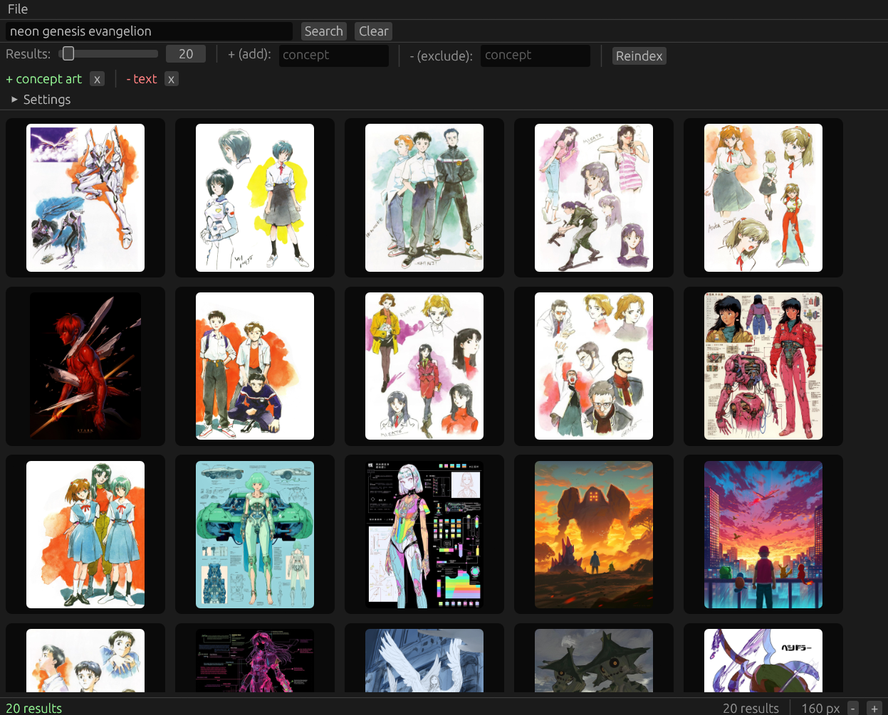

# rclipthing
A GUI natural language image searcher, on top of rclip

## Features
- Search using a natural language query
- Add or remove concepts
- Preview images in a grid
- Add automatically indexed paths

## Screenshot

## Download
[Linux](https://github.com/plucafs/rclipthing/releases/download/v0.1.0/rclipthing-linux)

## Credits
- [rclip](https://github.com/yurijmikhalevich/rclip)
- [OpenCode](https://github.com/anomalyco/opencode)

## License
MIT